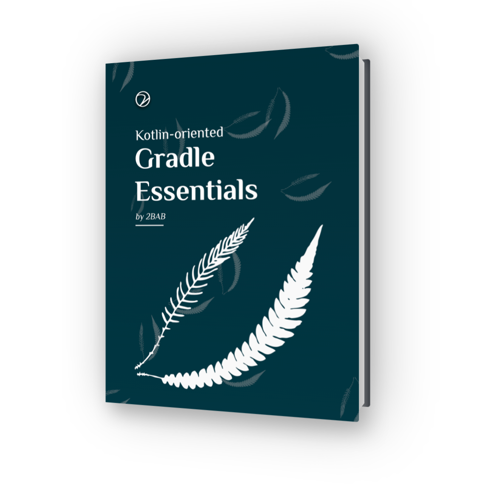

# KOGE



KOGE stands for Kotlin-oriented Gradle Essentials, a concise self-study handbook for Gradle and Android build tooling.

Read it in [English](https://koge.2bab.com/) or [简体中文](https://koge.2bab.com/zh-cn/).

For advanced Gradle and Android Gradle Plugin (AGP) skills with Kotlin, refer to *[Extending Android Builds](https://eab.2bab.com)*. KOGE is served as a preparatory lesson for that book.

## Local Development

This repo is now a single-book consumer of `@2bab/minibook-kit`, which owns the shared VitePress theme, config loader, CLI, and deployment workflow. The kit is consumed from a GitHub release tag, not npm.

```sh
pnpm install
pnpm dev
pnpm build
pnpm preview
```

## Configuration

- `minibook-kit.config.ts`: KOGE owner, social links, theme colors, analytics, and deployment defaults.
- `koge/book.config.ts`: KOGE title, description, locales, and sidebar.
- `.vitepress/config.ts` and `.vitepress/theme/index.ts`: thin wrappers that import the shared kit.

## Deployment

`.github/workflows/deploy.yml` calls the reusable Cloudflare Pages workflow from `2BAB/minibook-kit` at the same release tag used by `package.json`.

Required repository secrets:

- `CLOUDFLARE_ACCOUNT_ID`
- `CLOUDFLARE_API_TOKEN`
