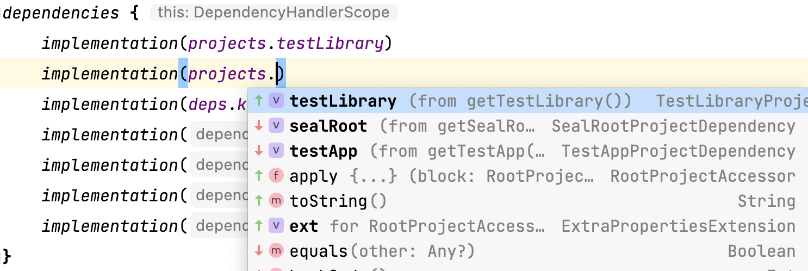

# Dependency Management

In the [Getting Started](/zh-cn/basis/getting-started) section, we've already covered the basics of project structure and the role of the `build.gradle(.kts)` file. This section delves into how to connect a single module with its internal and external counterparts, essentially managing dependencies.


## Incorporating Remote Dependencies (Classic Approach)

Typically, we use a two-level project structure, where:

- The root directory's `build.gradle.kts` serves as the parent `Project`, defining `buildscript{}` for declaring dependencies and repositories (mainly Gradle plugins) and `allprojects{ repository{} }` for runtime dependency repositories. The following code is from the root `build.gradle.kts` of ["kotlin-dsl-samples/samples/hello-android"@Kotlin](https://github.com/2BAB/kotlin-dsl-samples/blob/master/samples/hello-android/build.gradle.kts):

``` Kotlin
// Top-level build file where you can add configuration options common to all sub-projects/modules.

buildscript {
    repositories {
        google()
        jcenter()
    }
    dependencies {
        classpath("com.android.tools.build:gradle:3.1.3")
        classpath(kotlin("gradle-plugin", version = "1.3.70"))

        // NOTE: Do not place your application dependencies here; they belong
        // in the individual module build.gradle.kts files
    }
}

allprojects {
    repositories {
        google()
        jcenter()
    }
}
```

- The specific module's `build.gradle.kts` acts as a child `Project`, with dependencies generally for its own runtime/test scenarios:

``` Kotlin
dependencies {
    implementation(fileTree(mapOf("dir" to "libs", "include" to listOf("*.jar"))))
    implementation(kotlin("stdlib-jdk7", KotlinCompilerVersion.VERSION))
    implementation("com.android.support:appcompat-v7:27.1.1")
    debugImplementation("com.android.support.constraint:constraint-layout:1.1.0")
    testImplementation("junit:junit:4.12")
    androidTestImplementation("com.android.support.test:runner:1.0.2")
    androidTestImplementation("com.android.support.test.espresso:espresso-core:3.0.2")
}
```

Key configuration differences include:

1. Configurations like `implementation`, `compileOnly`, `api` are methods provided by AGP: [Dependency configurations"@Android](https://developer.android.com/studio/build/dependencies#dependency_configurations).
2. `debugImplementation` and similar are known as variant aware configurations, applied only when packaging for that variant: ["Configure build variants"@Android](https://developer.android.com/studio/build/build-variants).
3. `testImplementation` is for local unit testing (environment and testing method implied).
4. `androidTestImplementation` is for Android environment instrument tests (implies environment, could be unit or integration tests).
5. `kotlin("stdlib-jdk7", ...)` is a shortcut, ultimately resolving to `org.jetbrains.kotlin:kotlin-stdlib-jdk7:xxx`: ["Kotlin-Gradle"@Kotlin](https://kotlinlang.org/docs/gradle.html#set-dependencies-at-the-top-level).
6. `KotlinCompilerVersion.VERSION` is from `buildSrc` (or an included independent project): see [buildSrc](/zh-cn/basis/advanced-scripts).

## Incorporating Remote Dependencies (Modern Approach)

Gradle 6.x and 7.x introduced new APIs to replace the above dependency management APIs:

``` Kotlin
// https://github.com/2BAB/Seal/blob/3.1.0/settings.gradle.kts
pluginManagement {
    // The plugins block can be extracted to root's build.gradle.kts as well,
    // you can see that new Android Studio (2021+) already did these for you
    // when you created a new project using it.
    plugins {
        kotlin("android") version "1.5.31" apply false
        id("com.android.application") version "7.0.4" apply false
        id("com.android.library") version "7.0.4" apply false
    }
    resolutionStrategy {
        eachPlugin {
            if(requested.id.id == "me.2bab.seal") {
                useModule("me.2bab:seal:+")
            }
        }
    }
    repositories {
        mavenCentral()
        google()
        gradlePluginPortal()
        mavenLocal()
    }
}

dependencyResolutionManagement {
    repositories {
        google()
        mavenCentral()
        mavenLocal()
    }
    versionCatalogs {
        create("deps") {
            from(files("./deps.versions.toml"))
        }
    }
}
```

Key changes:

1. `buildscript` is replaced by `pluginManagement`, with `dependencies` directly replaced by `plugins`.
2. `resolutionStrategy` is used for specific coordinates when needed, primarily for dependency conflict resolution.
3. `allprojects{ repositories{} }` is replaced by `dependencyResolutionManagement { repositories{} }`, and `versionCatalogs` is a new API for shared dependencies across modules/projects. See the custom `.toml` file example below:

``` TOML
// https://github.com/2BAB/Seal/blob/3.1.0/deps.versions.toml
[versions]
kotlinVer = "1.5.31"
agpVer = "7.0.3"
polyfillVer = "0.4.0"
mockitoVer = "3.9.0"

[libraries]
android-gradle-plugin = { module = "com.android.tools.build:gradle", version.ref = "agpVer" }
kotlin-std = { module = "org.jetbrains.kotlin:kotlin-stdlib-jdk8", version.ref = "kotlinVer" }
kotlin-serialization = { module = "org.jetbrains.kotlinx:kotlinx-serialization-core-jvm", version = "1.3.1" }
polyfill-main = { module = "me.2bab:polyfill", version.ref = "polyfillVer" }
polyfill-manifest = { module = "me.2bab:polyfill-manifest", version.ref = "polyfillVer" }
fastJson = { module = "com.alibaba:fastjson", version = "1.2.73" }
zip4j = { module = "net.lingala.zip4j:zip4j", version = "2.6.2" }
junit = { module = "junit:junit", version = "4.12" }
mockito = { module = "org.mockito:mockito-core", version.ref = "mockitoVer" }
mockitoInline = { module = "org.mockito:mockito-inline", version.ref = "mockitoVer" }

[bundles]

[plugins]

```
Gradle automatically generates dependency declarations with the same name as the file in the Sync phase. These declarations, such as deps.xxx, make it easy to quickly add dependencies to multiple modules. Here is how it's used in modules:

``` Kotlin
// https://github.com/2BAB/Seal/blob/3.1.0/seal/plugin/build.gradle.kts
dependencies {
    implementation(deps.polyfill.main)
    implementation(deps.polyfill.manifest)

    implementation(gradleApi())
    implementation(deps.kotlin.std)
    implementation(deps.kotlin.serialization)

    compileOnly(deps.android.gradle.plugin)

    testImplementation(gradleTestKit())
    testImplementation(deps.junit)
    testImplementation(deps.mockito)
    testImplementation(deps.mockitoInline)
    testImplementation(deps.fastJson)
    testImplementation(deps.zip4j)
}
```

Refer to these documents/articles for a complete overview:

1. ["Plugin Management"@Gradle](https://docs.gradle.org/current/userguide/plugins.html#sec:plugin_management)
2. ["Sharing dependency versions between projects"@Gradle](https://docs.gradle.org/current/userguide/platforms.html)
3. ["It’s time to ditch the buildscript block"@Stefan M.](https://stefma.medium.com/its-time-to-ditch-the-buildscript-block-a1ab12e0d9ce)


## Incorporating Local Modules (Classic Approach)

For projects with multiple modules, organize the structure as per:

- ["Structuring and Building a Software Component with Gradle"@Gradle](https://docs.gradle.org/current/userguide/multi_project_builds.html)

Modules depend on each other using `implementation(project(":$modulePath"))`. Gradle uses ":" as the file path separator, so deep module references need full paths: `project(":commons:utils:b")`.

### Incorporating Local Modules (Modern Approach)

Besides standard `project(":test-library")`, Gradle introduced TypeSafe Project Accessor, currently in preview. Enable it in `settings.gradle.kts`:

``` Kotlin
enableFeaturePreview("TYPESAFE_PROJECT_ACCESSORS")
```

This generates accessors for all modules in the project. For example, referencing a module named “test-library” in the `app` module:

``` Kotlin
implementation(projects.testLibrary)
```



The generated helper class:


- ["TypeSafe Project Accessor Official Introduction"@Gradle](https://docs.gradle.org/7.0/release-notes.html)
- ["Using type-safe project dependencies on Gradle"@Igor Escodro](https://proandroiddev.com/using-type-safe-project-dependencies-on-gradle-493ab7337aa)


## Incorporating Local AARs (Optimal Approach)

The best approach is to create an empty Gradle module and add two lines to `build.gradle.kts` for the local `.aar`.

- ["Put your AAR into a separate module."@JRod](https://stackoverflow.com/a/70074787/3614547)


``` Kotlin
configurations.maybeCreate("default")
artifacts.add("default", file('spotify-app-remote-release-0.7.1.aar'))
```

## Summary

This section introduced several practical dependency management APIs. For a deeper understanding of Dependency containers, custom references, etc., consult the official documentation:

- ["Declaring dependencies"@Gradle](https://docs.gradle.org/current/userguide/declaring_dependencies.html)