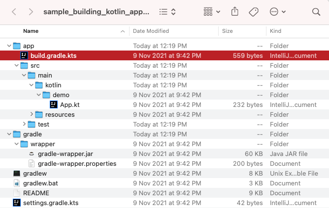

# Getting Started

## What is Gradle

For those new to Gradle, a quick overview of its Wikipedia page and official documentation introduction is recommended. To understand the relationship between Gradle and Android Studio, why Android chose Gradle as its build tool, and the significance of CLI commands and the role of AGP, refer to the following links:

1. ["Gradle"@Wikipedia](https://en.wikipedia.org/wiki/Gradle)
2. ["What is Gradle?"@Gradle](https://docs.gradle.org/current/userguide/what_is_gradle.html)
3. ["What is Gradle in Android Studio?"@GagandeepSingh](https://stackoverflow.com/a/24828666/3614547)
4. ["Google IO 2013 The New Android SDK Build System"@Google](https://v.youku.com/v_show/id_XNTYwMzY0NDYw.html?spm=a2h1n.8251843.playList.5!4~1!2~3~A&f=19280821&o=1)

## What is Android Gradle Plugin (AGP)

For beginners, understanding the relationship between Gradle and the Android Gradle Plugin might be confusing. Essentially, Gradle serves as a platform handling basic infrastructure like scripting capabilities, dependency management, and the Task mechanism. Specific compilation features need to be implemented by each language and framework.

1. ["Difference between Android Gradle plugin and Gradle"](https://stackoverflow.com/questions/49156528/difference-between-android-gradle-plugin-and-gradle)
2. ["Android Gradle Plugin Version Notes"@Google](https://developer.android.com/studio/releases/gradle-plugin)

You'll find more about other official plugins in the [Regular Tasks](./regular-tasks.md) section.

Since May 2023, all AGP documentation has been consolidated by Android officials, creating a new, independent navigation and tab at [https://developer.android.com/build](https://developer.android.com/build). This offers one-stop access to all public content, from "Getting Started" and "Library Publishing" to "Extending Functionality."


## Gradle Project Structure Examples

The most basic Gradle projects can be found in Gradle's official samples:

1. ["Sample Index"@Gradle](https://docs.gradle.org/current/samples/index.html): The homepage of samples, listing all official project examples and continuously updated.
2. ["Building Kotlin Applications Sample"@Gradle](https://docs.gradle.org/current/samples/sample_building_kotlin_applications.html): Detailed tutorial for Kotlin examples, listing each file and step created.
3. ["Building Android Apps Sample"@Gradle](https://docs.gradle.org/current/samples/sample_building_android_apps.html): Android samples are based on Android Official’s [Building Your First App](https://developer.android.com/training/basics/firstapp) tutorial and are suitable for code reading in conjunction with the tutorial.



Additionally, Android Studio's new project creation functionality currently only supports Gradle Groovy DSL projects. To learn how to migrate or write Gradle Kotlin DSL content, refer to the [Kotlin Script (KTS) and DSL](./kotlin-dsl.md) section.

For explanations about project structure and Gradle files, consult the following content:

1. ["Gradle 102: Gradle Basics"@Shivam](https://medium.com/@shivam.gosavi340_58315/gradle-102-gradle-basics-798db70a6c20)
2. ["Build Script Basics"@Gradle](https://docs.gradle.org/current/userguide/tutorial_using_tasks.html)
3. ["Managing Dependencies of JVM Projects"@Gradle](https://docs.gradle.org/current/userguide/dependency_management_for_java_projects.html)

## Building Your App from the Command Line

Android Studio's compilation feature is also based on Gradle Tasks. Starting with CLI for compilation helps understand the build system better, such as the relationship between task names and variants, and how parameters are passed. Generally, **Gradlew Wrapper** is recommended for running Gradle commands:

- ["Gradle Wrapper"@Gradle](https://docs.gradle.org/current/userguide/gradle_wrapper.html)

The mentioned sample projects include this script tool, which can run Kotlin or Android projects:

``` Shell
$ cat local.properties
sdk.dir=/Users/2bab/Library/Android/sdk
$ ./gradlew clean assembleDebug -q
...
```

Note that Android projects require the Android SDK directory in the project root (usually in `local.properties`). For more details, refer to:

- ["Configure Your Build"@Android](https://developer.android.com/studio/build)

The following Android documentation elaborates on various common AGP and Android SDK commands for building, installing compiled APK/AAB, etc.:

- ["Building

 Your App from the Command Line"@Google](https://developer.android.com/studio/build/building-cmdline)

## Gradle World Glossary

https://github.com/autonomousapps/gradle-glossary

## Summary

The quickest way to get started with Gradle is by downloading official sample projects, running a few commands to test, and then referring to several articles for project structure explanations to understand the roles of files like `build.gradle(.kts)` and `settings.gradle.kts`, and how to organize a single-module project.