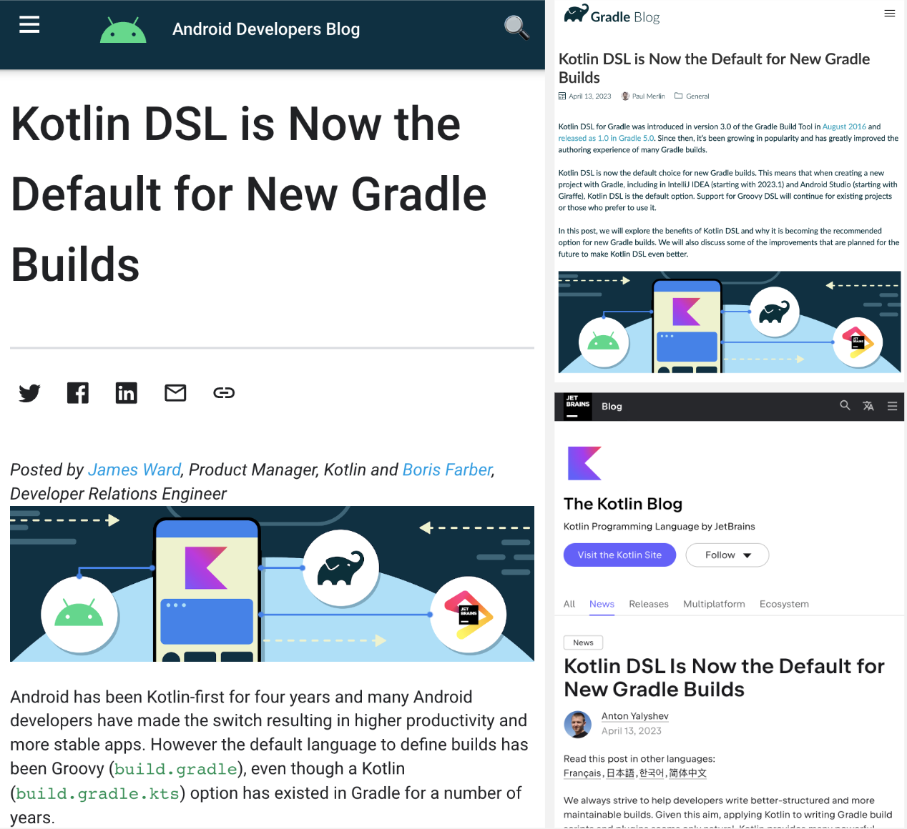

# Kotlin Script (KTS) and DSL

## Introduction to Kotlin Script (KTS) and DSL

In April 2023, at the Kotlin Conf, it was announced that "Kotlin DSL is now the default for new Gradle builds." Kotlin was integrated into Gradle's build tools as early as 2016 and has become the default choice for developers in 2023.

This section explores the origins and development of Kotlin Script and DSL, providing insights into `*.gradle.kts` files.

## Generic KTS Scripts

KTS, or Kotlin Script, is often mistakenly thought to be limited to Gradle scripts. However, `*.kts` files are versatile Kotlin scripts used in various domains. Similar to Shell or Python scripts, KTS offers uniformity and ease of use, with the added ability to reference external dependencies. The downside is that systems need to install Kotlin dependencies, which are not typically pre-installed.

There are two main KTS standards:

- ["KScript"@holgerbrandl](https://github.com/holgerbrandl/kscript/): Established in 2016 by a third party, it uses the `*.kts` extension and includes features like script caching, external dependency references, command line interpreters, and auto-generation of Gradle projects for IDE integration. Besides Kotlin, KScript tool installation is required.
- ["Official Kotlin Standard"](https://github.com/Kotlin/KEEP/blob/master/proposals/scripting-support.md): Adopted by Kotlin in version 1.3 and uses the `*.main.kts` extension. It incorporates many of KScript’s main features and supports dependency referencing directly in IntelliJ IDEA without needing a Gradle project.

Examples of KTS in use:

1. ["rock3r/deep-clean"@SebastianoPoggi](https://github.com/rock3r/deep-clean/blob/master/deep-clean.kts)
2. ["kotlin-script-examples"@Kotlin](https://github.com/Kotlin/kotlin-script-examples)

For a detailed comparison and history of these standards, refer to:

- ["The state of Kotlin Scripting"@MartinBonnin](https://medium.com/@mbonnin/may-2020-the-state-of-kotlin-scripting-99cb6cc57db1)

## Generic Kotlin DSL

Like KTS, Kotlin DSL is not confined to Gradle scripts and can be found in many other areas. To understand its application, it's important to know the fundamental elements that make up Kotlin DSL. The following articles and documents offer a comprehensive look at Kotlin DSL, from high-order functions to Type-safe builders:

1. ["High-order functions and lambdas"@Kotlin](https://kotlinlang.org/docs/lambdas.html)
2. ["Type-safe builders"@Kotlin](https://kotlinlang.org/docs/type-safe-builders.html)
3. ["Kotlin DSL | Introduction"@GlennSandoval](https://medium.com/kotlin-and-kotlin-for-android/kotlin-dsl-introduction-6123c43ae770)
4. ["Domain-Specific Languages In Kotlin: Getting Started"@TinoBalint](https://www.raywenderlich.com/2780058-domain-specific-languages-in-kotlin-getting-started)

Kotlin DSL is also implemented in these well-known libraries:

1. ["Koin"@InsertKoinIO](https://github.com/InsertKoinIO/koin)
2. ["Ktor"@Kotlin](https://github.com/ktorio/ktor)

## *.gradle.kts

Gradle Kotlin DSL is built on generic KTS scripts, further defining the script's Context (like `Project` and `Settings` objects) and adding DSL features for simplified configurations. The following resources provide extensive information on Gradle Kotlin DSL, migration from Groovy to Kotlin, and developing plugins with Kotlin:

1. ["Gradle Kotlin DSL Primer"@Gradle](https://docs.gradle.org/current/userguide/kotlin_dsl.html)
2. ["Migrating build logic from Groovy to Kotlin"@Gradle](https://docs.gradle.org/current/userguide/migrating_from_groovy_to_kotlin_dsl.html)
3. ["Migrating Build Configurations from Groovy to KTS"@Android](https://developer.android.com/studio/build/migrate-to-kts)
4. ["gradle/kotlin-dsl-samples"@Gradle](https://github.com/gradle/kotlin-dsl-samples/tree/master/samples)
5. ["Delegated properties"@Kotlin](https://kotlinlang.org/docs/delegated-properties.html)
6. ["Mixing Groovy and Kotlin in Plugin Development"@小灵通 (in Simplified Chinese)](https://juejin.cn/post/7084949825866694686/)

## Summary

Understanding generic Kotlin Script and DSL can bring significant convenience to our work, allowing one language to meet multiple job requirements. While official support isn't exclusively for KTS, as mentioned earlier, Gradle Kotlin DSL is the recommended approach by three major companies. For plugin development, Kotlin is widely supported, offering higher readability, better compile-time checks, and improved IDE support compared to Groovy.

- ["Prefer using a statically-typed language to implement a plugin"@Gradle](https://docs.gradle.org/current/userguide/designing_gradle_plugins.html#prefer_using_a_statically_typed_language_to_implement_a_plugin)