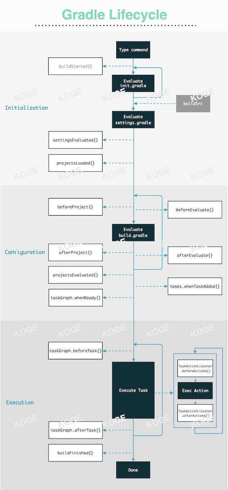

# Gradle Lifecycle

## Understanding the Gradle Lifecycle

The lifecycle of Gradle itself can be understood from the diagram above. Key points include:

- The main process, marked by multiple black modules, represents the core execution phases within the Gradle framework's lifecycle.
- The white modules on the left, connected by dashed lines, are lifecycle hooks attached to the `Gradle` object. For instance, you can use `gradle.afterProject {}` to pass a closure that is triggered after each `Project` is initialized.
- The white modules on the right, also connected by dashed lines, are lifecycle hooks attached to the `Project` object. For example, you can trigger a hook by passing a closure to `project.afterEvaluate {}`.

Official documentation on the three major lifecycle phases is somewhat rudimentary. It is recommended to read the second article below for a more comprehensive understanding:

1. ["Build Lifecycle"@Gradle](https://docs.gradle.org/current/userguide/build_lifecycle.html)
2. ["Gradle 103: Build Life Cycle"@Shivam](https://medium.com/@shivam.gosavi340_58315/gradle-103-build-life-cycle-6d1b595d72cc)

Regarding lifecycle hooks, only about 30% are commonly used. The links below include API documentation for these interfaces and practical examples of using `afterEvaluate` and `tasks.whenReady{}`:

1. ["Interface BuildListener"@Gradle](https://docs.gradle.org/current/javadoc/org/gradle/BuildListener.html)
2. ["Interface TaskExecutionListener"@Gradle](https://docs.gradle.org/current/javadoc/org/gradle/api/execution/TaskExecutionListener.html)
3. ["Interface Project"@Gradle](https://docs.gradle.org/current/javadoc/org/gradle/api/Project.html#beforeEvaluate-groovy.lang.Closure-)
4. [Search afterEvaluate{} on "Triple-T/gradle-play-publisher"@AlexSaveau](https://github.com/Triple-T/gradle-play-publisher/search?q=afterevaluate)
5. ["How to exclude a task in Gradle?"@Brook'sStudio](https://brookbach.com/tech/2020/03/12/gradle-exclude-task-en.html)
6. [Caution with Using `afterEvaluate{}`](https://discuss.gradle.org/t/is-project-afterevaluate-the-proper-way-for-gradle-plugin-to-dynamically-create-default-tasks/31349)

## Android Gradle Plugin (AGP) Lifecycle

While there is no official "lifecycle" reference for AGP, its process can be broadly divided into:

1. Safety checks.
2. Configuration and creation of various Builders, Extensions, Services, etc.
3. Creation of Tasks, whether Variant-related or not.

This process is similar to implementing a simple custom Plugin, but with a vastly larger scale of logic, including a variety of internal tools and services. For beginners, it's more important to understand what tasks are performed during the execution phase, their order, and how to interact with them. For more information, refer to:

1. [Regular Tasks](./regular-tasks.md)
2. [Customized Tasks](../customization/customized-task.md)

## Summary

This section is crucial for understanding some of Gradle's design principles. Here are some efficient tips:

- Avoid any IO or CPU-intensive operations during the Configuration phase. Utilize various lazy APIs to register Tasks and parse files for parameters.
- Refrain from registering numerous lifecycle callbacks in the root project using `subprojects{ ... }`, as it can impact performance. Instead, use plugins to refine granularity and enable on-demand loading. Often, not every sub-project requires the same logic.
