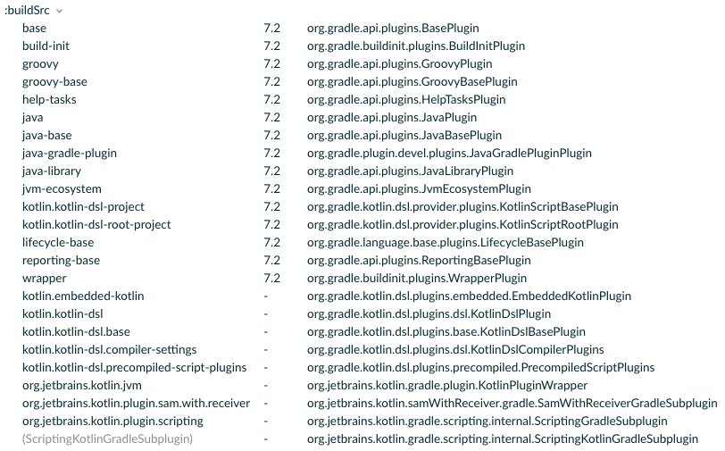

# Regular Tasks

This section delves into the origins of common Gradle tasks and their underlying relationships.

## The Base Plugin

Taking the commonly used `buildSrc` build environment as an example, the contents of a `build.gradle(.kts)` file and the executable tasks don't solely originate from the Gradle Java Plugin. Often, they are a combination of multiple plugins.



The Base Plugin is one of the most fundamental plugins in Gradle, primarily known for defining several common lifecycle tasks:

- ["The Base Plugin"@Gradle](https://docs.gradle.org/current/userguide/base_plugin.html): Offers a comprehensive understanding of the Base Plugin, including the basic tasks mentioned later.
- ["Lifecycle tasks"@Gradle](https://docs.gradle.org/current/userguide/more_about_tasks.html#sec:lifecycle_tasks): Details what lifecycle tasks are.

In Android development, frequently used CLI tasks are extensions of these nodes:

- `clean`
- `check`
- `assemble`
- `build`
- `buildConfiguration`
- `cleanTask`

The remaining configurations, such as `archiveBaseName` and `archiveVersion` in `BasePluginExtension`, are often used as default names for artifacts in other plugins.

``` Kotlin
base {
    archivesName.set("gradle")
}
```

## The Java Plugin

As mentioned earlier, the Java Plugin internally also utilizes the Base Plugin:

``` Java
public class JavaPlugin implements Plugin<Project> {
    @Override
    public void apply(final Project project) {
        ...
        final ProjectInternal projectInternal = (ProjectInternal) project;
        project.getPluginManager().apply(JavaBasePlugin.class);
        ...
    }
}
public class JavaBasePlugin implements Plugin<Project> {
    @Override
    public void apply(final Project project) {
        ProjectInternal projectInternal = (ProjectInternal) project;
        project.getPluginManager().apply(BasePlugin.class);
        project.getPluginManager().apply(JvmEcosystemPlugin.class);
        project.getPluginManager().apply(ReportingBasePlugin.class);
        ...
    }
}    
```

Additionally, it expands tasks, SourceSets, and Dependency Configurations commonly seen in Android development:

- ["The Java Plugin"@Gradle](https://docs.gradle.org/current/userguide/java_plugin.html): Provides a full understanding of the Java Plugin, which is also beneficial for grasping the Android Gradle Plugin.

<ImageZoom 
  src="/media/regular-tasks-java-plugin-tasks.png" 
  :border="false" 
  width="100%"/>


## The Android Gradle Plugin (AGP)

<ImageZoom 
  src="/media/regular-tasks-app.png" 
  :border="false" 
  width="100%"/>

A typical Android Application module contains multiple plugins. The inclusion of numerous resource files and the addition of BuildTypes and Variants result in a significant increase in the number of tasks. Before diving into specific tasks, it's beneficial to understand the Android Build Workflow:

- ["Build Workflow"@Android](http://tools.android.com/tech-docs/new-build-system/build-workflow)

!<ImageZoom 
  src="/media/regular-tasks-android-build-flow.png" 
  :border="false" 
  width="100%"/>


Common commands include `assembleDebug`, `clean`, and `testDebug`. For example, running `./gradlew clean :app:assembleDebug --dry-run` on a fresh Android Application project will show the required tasks and their execution order.

``` Shell
$ ./gradlew clean :app:assembleDebug --dry-run

:clean SKIPPED
:app:clean SKIPPED
:app:preBuild SKIPPED
:app:preDebugBuild SKIPPED
:app:compileDebugAidl SKIPPED
:app:compileDebugRenderscript SKIPPED
:app:generateDebugBuildConfig SKIPPED
:app:checkDebugAarMetadata SKIPPED
:app:generateDebugResValues SKIPPED
:app:generateDebugResources SKIPPED
:app:mergeDebugResources SKIPPED
:app:packageDebugResources SKIPPED
:app:parseDebugLocalResources SKIPPED
:app:createDebugCompatibleScreenManifests SKIPPED
:app:extractDeepLinksDebug SKIPPED
:app:processDebugMainManifest SKIPPED
:app:processDebugManifest SKIPPED
:app:processDebugManifestForPackage SKIPPED
:app:processDebugResources SKIPPED
:app:compileDebugKotlin SKIPPED
:app:javaPreCompileDebug SKIPPED
:app:compileDebugJavaWithJavac SKIPPED
:app:mergeDebugShaders SKIPPED
:app:compileDebugShaders SKIPPED
:app:generateDebugAssets SKIPPED
:app:mergeDebugAssets SKIPPED
:app:compressDebugAssets SKIPPED
:app:processDebugJavaRes SKIPPED
:app:mergeDebugJavaResource SKIPPED
:app:checkDebugDuplicateClasses SKIPPED
:app:desugarDebugFileDependencies SKIPPED
:app:mergeExtDexDebug SKIPPED
:app:mergeLibDexDebug SKIPPED
:app:dexBuilderDebug SKIPPED
:app:mergeProjectDexDebug SKIPPED
:app:mergeDebugJniLibFolders SKIPPED
:app:mergeDebugNativeLibs SKIPPED
:app:stripDebugDebugSymbols SKIPPED
:app:validateSigningDebug SKIPPED
:app:writeDebugAppMetadata SKIPPED
:app:writeDebugSigningConfigVersions SKIPPED
:app:packageDebug SKIPPED
:app:createDebugApkListingFileRedirect SKIPPED
:app:mergeDebugNativeDebugMetadata SKIPPED
:app:assembleDebug SKIPPED
```

Unfortunately, it's not feasible to display all task dependencies here, but there are two common methods to view the dependency tree:

1. Use the `--scan` feature’s Timeline, which allows you to see the preceding and succeeding tasks for each executed task:

   ``` Shell
   $ ./gradlew clean :app:assembleDebug --scan
   ```

 <ImageZoom 
  src="/media/regular-tasks-predecessors.png" 
  :border="false" 
  width="100%"/>

2. Use a task analysis plugin to export textual or visual dependency relationships, such as ["gradle-taskinfo"barfuin](https://gitlab.com/barfuin/gradle-taskinfo#gradle-taskinfo):

``` Shell
$ ./gradlew tiTree assemble

:assemble                             (org.gradle.api.DefaultTask)
+--- :jar                             (org.gradle.api.tasks.bundling.Jar)
|    `--- :classes                    (org.gradle.api.DefaultTask)
|         +--- :compileJava           (org.gradle.api.tasks.compile.JavaCompile)
|         `--- :processResources      (org.gradle.language.jvm.tasks.ProcessResources)
+--- :javadocJar                      (org.gradle.api.tasks.bundling.Jar)
|    `--- :javadoc                    (org.gradle.api.tasks.javadoc.Javadoc)
|         `--- :classes               (org.gradle.api.DefaultTask)
|              +--- :compileJava      (org.gradle.api.tasks.compile.JavaCompile)
|              `--- :processResources (org.gradle.language.jvm.tasks.ProcessResources)
`--- :sourcesJar                      (org.gradle.api.tasks.bundling.Jar)
```

   This plugin will provide a detailed tree structure of task dependencies.

For a quick overview of tasks' implementation, refer to the analysis based on AGP 3.0.1 ["Analysis of Major Tasks in Android Gradle Plugin"@ZYLAB (in Simplified Chinese)](https://juejin.cn/post/6844903854190886925).


## Summary

- Beginners should start with a simple model to understand Gradle tasks, as diving directly into the complex array of AGP tasks can be overwhelming.
- The concept of lifecycle tasks is both simple and useful. Custom tasks can also flexibly extend more lifecycle tasks for enhanced functionality.
