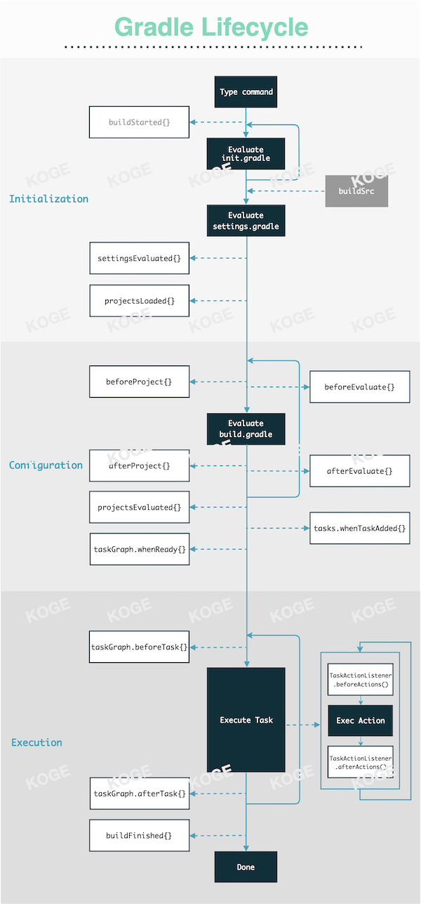

# 生命周期

## Gradle 生命周期

Gradle 本体的生命周期其实如上一张图就能看的明白，其中：

- 多个黑色模块的主流程部分，是 Gradle 框架整个生命周期中主要执行的内容；
- 虚线连接的左侧白色模块，是挂载在 `Gradle` 对象上的生命周期钩子函数，例如你可以通过 `gradle.afterProject {}` 传入一个闭包，当每个 `Project` 被初始化后便会触发一次该闭包执行；
- 虚线连接的右侧白色模块，是挂载在 `Project` 对象上的生命周期钩子函数，例如你可以通过 `project.afterEvaluate {}` 传入一个闭包触发该 Hook； 

官方的文档对三大环节的梳理有些简陋，所以建议在快速浏览文档的基础上，多看看第二篇文章：

1. ["Build Lifecycle"@Gradle](https://docs.gradle.org/current/userguide/build_lifecycle.html)
2. ["Gradle 103: Build Life Cycle"@Shivam](https://medium.com/@shivam.gosavi340_58315/gradle-103-build-life-cycle-6d1b595d72cc)

而针对生命周期的 Hook，其实里面只有约 30% 是比较常见的。下方的链接中，1-3 是上述接口的一些 API 文档，4-6 是 `afterEvaluate` 和 `tasks.whenReady{}` 的使用案例：

1. ["Interface BuildListener"@Gradle](https://docs.gradle.org/current/javadoc/org/gradle/BuildListener.html)
2. ["Interface TaskExecutionListener"@Gradle](https://docs.gradle.org/current/javadoc/org/gradle/api/execution/TaskExecutionListener.html)
3. ["Interface Project"@Gradle](https://docs.gradle.org/current/javadoc/org/gradle/api/Project.html#beforeEvaluate-groovy.lang.Closure-)
4. [Search afterEvaluate{} on "Triple-T/gradle-play-publisher"@AlexSaveau](https://github.com/Triple-T/gradle-play-publisher/search?q=afterevaluate)
5. ["How to exclude a task in Gradle?"@Brook'sStudio](https://brookbach.com/tech/2020/03/12/gradle-exclude-task-en.html)
6. [慎重使用 `afterEavaluate{}`](https://discuss.gradle.org/t/is-project-afterevaluate-the-proper-way-for-gradle-plugin-to-dynamically-create-default-tasks/31349)

## AGP 生命周期

AGP 其实所谓官方给出的生命周期参考，但从流程上我们可以简单分为：

1. 安全检查
2. 各类 Builder，Extension，Service 等的配置和创建
3. Variant 无关/相关的 Task 创建

流程其实和自行实现一个简单的自定义 Plugin 差异不大，只不过逻辑实现的体量差别巨大，包括各式各样的内部工具、服务等。对于初学者来说，更重要的是了解执行期的 Tasks 都做了哪些事，先后顺序，如何与之交互等等。关于这块的内容请参考：

1. [常规任务](./regular-tasks.md)
2. [自定义任务](../customization/customized-task.md)

## 小结

本节对于理解 Gradle 的一些设计特别重要，我们最后再放出一些高效的小贴士：

- 不要在 Configuration 期做任何带来 IO、CPU 负荷的操作，合理运用各类惰性 API 去注册 Task、解析文件获取参数等；
- 不要在 root project 中使用 `subproject{ ... }` 注册大量生命周期回调，影响性能（取而代之的是使用插件，可以把颗粒度做细，可以按需加载，很多时候并不是每个子 Project 都需要一份同样的逻辑）；

